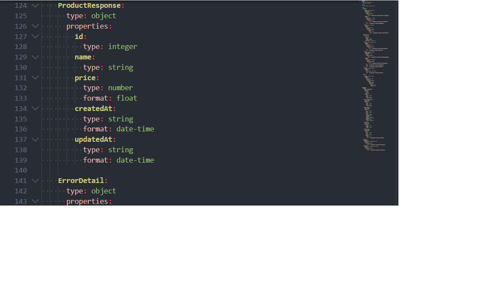

# Mini Shop

Міні-магазин для демонстрації CRUD-операцій із товарами.  
Проєкт включає сервер на Node.js, базу даних SQLite, API з OpenAPI документацією та юніт-тести.

---

## Встановлення та запуск

1. Клонуйте репозиторій:
```bash
git clone https://github.com/FrezzBee/mini-shop.git

## Запуск проекту

1. Встановити залежності:  
npm install

2. Запустити сервер:  
npm run dev

3. Сервер буде доступний за адресою:  
http://localhost:3000

## API документація

- Файл контракту: [openapi.yaml](docs/api/openapi.yaml)
- Скриншот у Swagger Editor: 

## Домени та моделі

- Контекстна діаграма: [context_map.png](docs/domain/context_map.png)
- Сутності: [entities.md](docs/domain/entities.md)
- Глосарій термінів: [glossary.md](docs/domain/glossary.md)

## Тести

- Використовується Jest:
npm test

- Покривають:
  - Створення нового товару
  - Отримання товару за id
  - Отримання всіх товарів

## Архітектура

- Стиль: модульний моноліт
- Шари:
  - api/ – маршрути та контролери
  - service/ – бізнес-логіка
  - domain/ – сутності та глосарій
- Заборонено: звертатися з api/ напряму до бази даних
